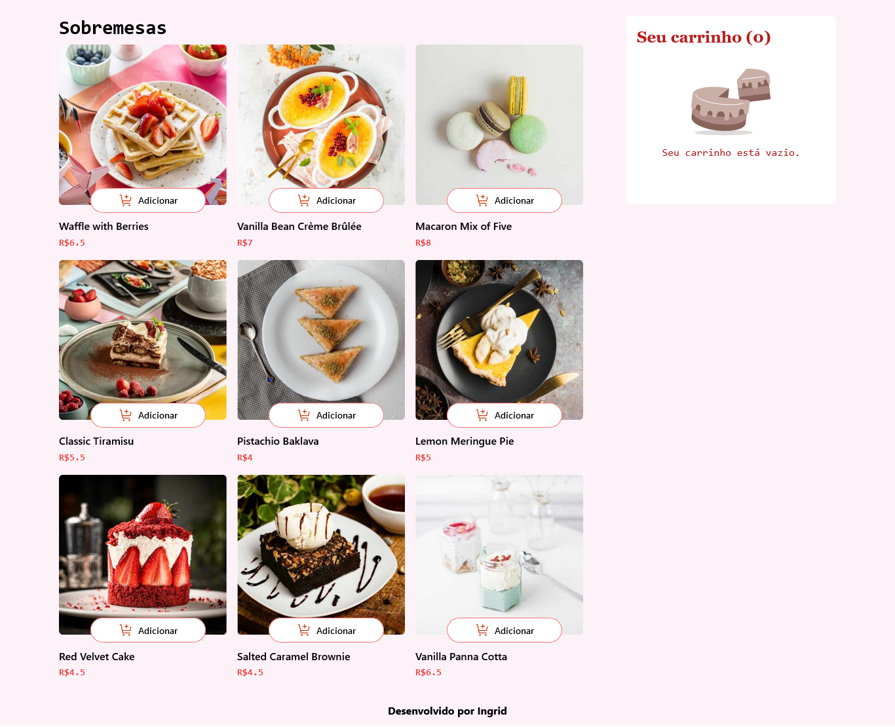
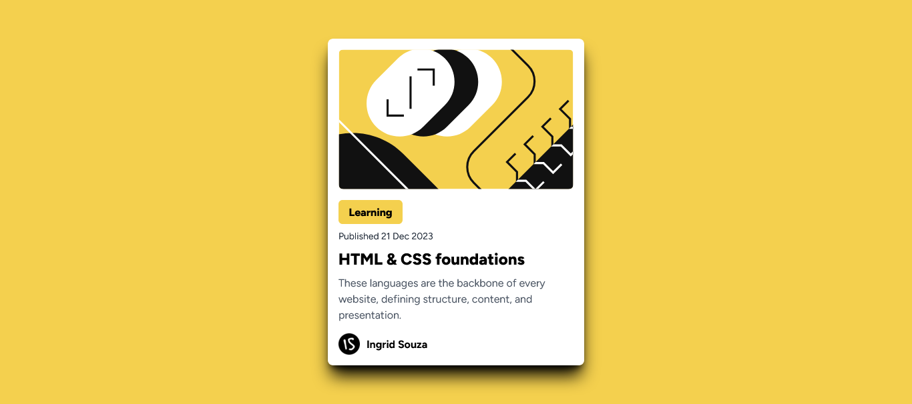
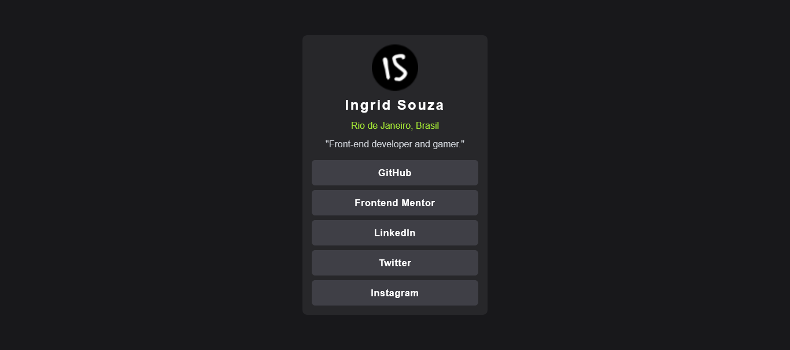
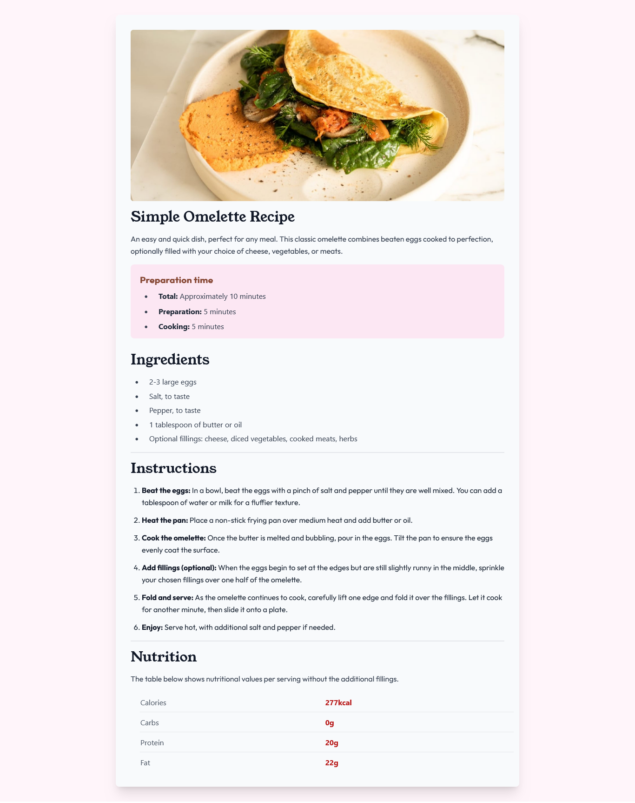
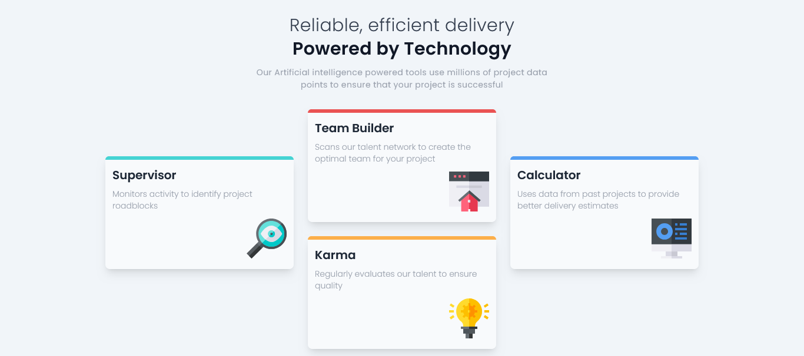
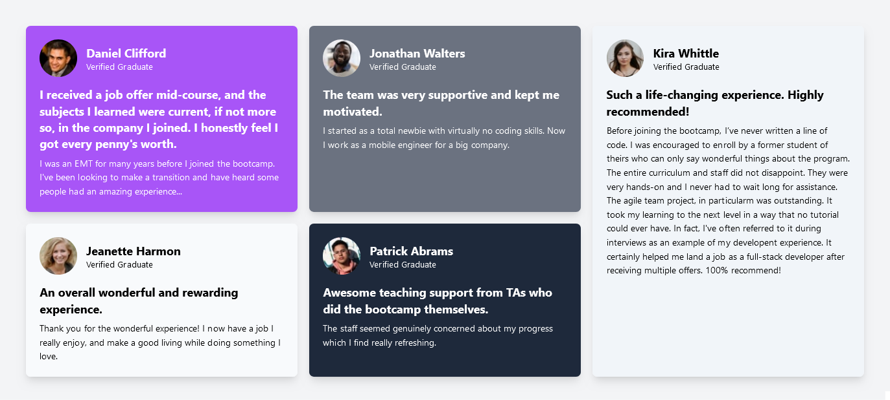
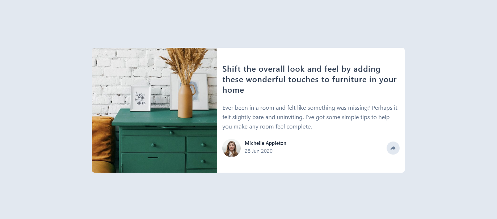

# 🖥️ Projetos do Front-end Mentor
Este repositório reúne os projetos que desenvolvi enquanto praticava React, Tailwind CSS e TypeScript no Front-end Mentor. Cada projeto é uma oportunidade para explorar diferentes conceitos e melhorar minhas habilidades em desenvolvimento front-end.

# 📝 Nota Importante

Os projetos não estão disponíveis no GitHub Pages. Para visualizá-los, você precisará:

* Clonar este repositório no seu computador;
* Instalar as dependências com o gerenciador de pacotes de sua preferência;
* Rodar o projeto no seu editor de código, como o VS Code.

Para mais detalhes, veja a documentação em cada projeto.

Para acessar o repositório, clique aqui: [Projetos no GitHub](https://github.com/IngridsSilveira/projetos)

## 🛒 [Product List](https://github.com/IngridsSilveira/projetos/tree/main/product-list)
Uma aplicação de lista de compras que permite aos usuários:

* Adicionar itens ao carrinho;
* Visualizar a quantidade de itens e o preço total;
* Ajustar a quantidade de itens no carrinho.

## 🌐 [Blog Preview Card](https://github.com/IngridsSilveira/projetos/tree/main/blog-preview-card)
Pré-visualização de um blog que apresenta:

* Uma imagem descritiva sobre o post;
* Um botão informativo;
* Data de publicação, título, descrição e autor.

## 📱 [Social Links Profile](https://github.com/IngridsSilveira/projetos/tree/main/social-links-profile)

Uma página com links para redes sociais que exibe:

* Imagem do autor;
* Nome e localização;
* Links para as redes sociais do autor.

## 🍳 [Recipe Page](https://github.com/IngridsSilveira/projetos/tree/main/recipe-page)

Site de receitas que ensina a fazer uma omelete, incluindo:

* Tempo de preparo;
* Ingredientes;
* Valor nutricional.

## 🎲 [Four Card Feature](https://github.com/IngridsSilveira/projetos/tree/main/four-card-feature)
Página com quatro cards que destacam os serviços oferecidos por uma empresa. O layout foi construído utilizando FlexBox.

## 🧩 [Testimonial Grid](https://github.com/IngridsSilveira/projetos/tree/main/testimonial-grid)

Página de testemunhos sobre um curso de desenvolvimento. O layout utiliza CSS Grid para organizar os depoimentos em formato de quadrados.

## 📰 [Article Preview](https://github.com/IngridsSilveira/projetos/tree/main/article-preview)

Este projeto é uma página de artigos feita pela autora Michelle, onde ela ensina a deixar sua casa maravilhosa.

## 📦 Tecnologias usadas:
 
 

## 👷 Autores

* **Ingrid Souza** - *Front-End* - [GitHub](https://github.com/IngridsSilveira)
