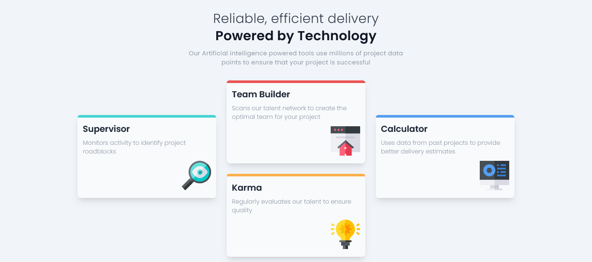

# Desafio Four Card - Frontend Mentor

Este é um projeto de um site onde temos quatro cards (quadrados), cada um informando o que a empresa providencia para os seus clientes, foi utilizado FlexBox para a construção dos cards.

## Tecnologias Utilizadas

- React: Biblioteca para construção da interface.
- TypeScript: Para tipagem estática e melhor manutenção do código.
- Tailwind CSS: Framework de CSS para estilização rápida e responsiva.
